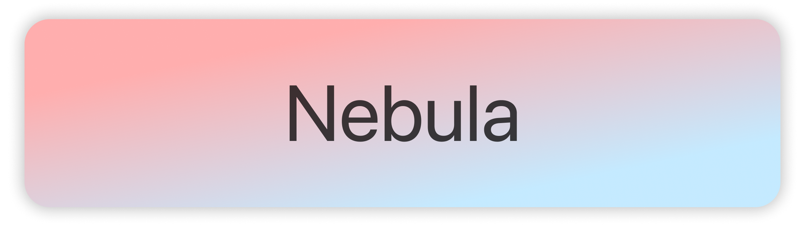

    
    
    
    
    

---

### About me

I'm Nebula, a developer from the United States. I started projects such as [palera1n](https://github.com/palera1n/palera1n) and [Permasigner](https://github.com/permasigner/permasigner). My favorite programming languages are Python and Typescript. I am learning how to build iOS apps with SwiftUI.

I'm currently working on [Nocturne](https://github.com/usenocturne), a custom firmware for the discontinued Spotify Car Thing.

If you need to contact me, you can do so at `me@itsnebula.net` or [Discord](https://discord.com/users/574669003755356162). If it is about some sort of security issue or private information, please encrypt your email with [my GPG key](https://static.itsnebula.net/gpgkey.asc) (`FB04F6C8EC56DA32F33008C53D1B28A5FACCB53B`).

If you want to know more about the languages and tools I use, please look at my [website](https://itsnebula.net)!

If you'd like to support me, you can check out my [GitHub Sponsors](https://github.com/sponsors/itsnebulalol), my [donation page](https://itsnebula.net/donate), or buy my iOS tweak [Ding](https://chariz.com/buy/ding).
